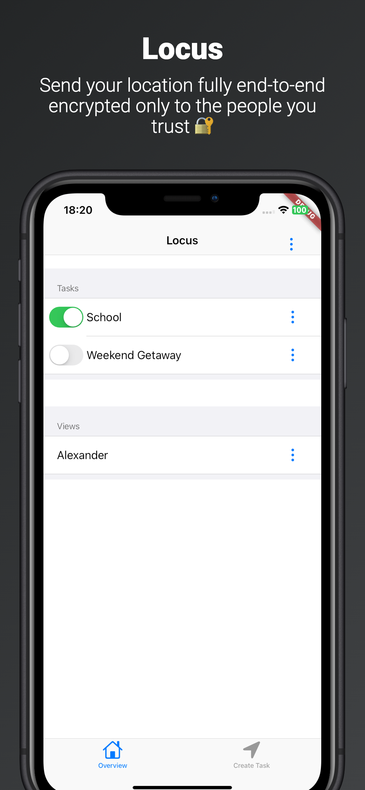
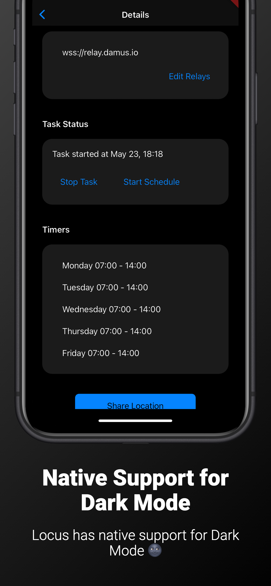
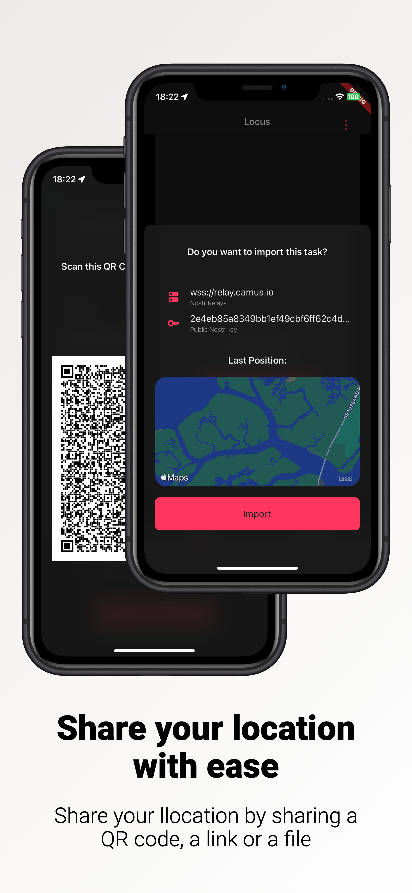

# Locus for iOS and iPadOS
> [!IMPORTANT]
> This repository is not verified by or affiliated with Myzel394 or any other Locus developers. The source code for Locus is available [here](https://github.com/Myzel394/locus).

Locus is a free, open source app that allows you to share your location live. It encrypts your location end-to-end, meaning that no one, not even the Locus developers, can read it. It stores the location decentralized on multiple servers of your choice using Nostr, meaning that you are not locked to a service. No authentication required.

### Screenshots

    
    
    

    
    
    
    

### Download
* On iOS and iPadOS, you can find the methods to download Locus through this repository [here](https://jbmagination.com/locus-ios). It is not verified by or affiliated with Myzel394 or any other Locus developers.
* On Android, the developers officially package Locus and distribute it through [F-Droid](https://f-droid.org/packages/app.myzel394.locus/) and [GitHub](https://github.com/Myzel394/locus/releases/latest).
