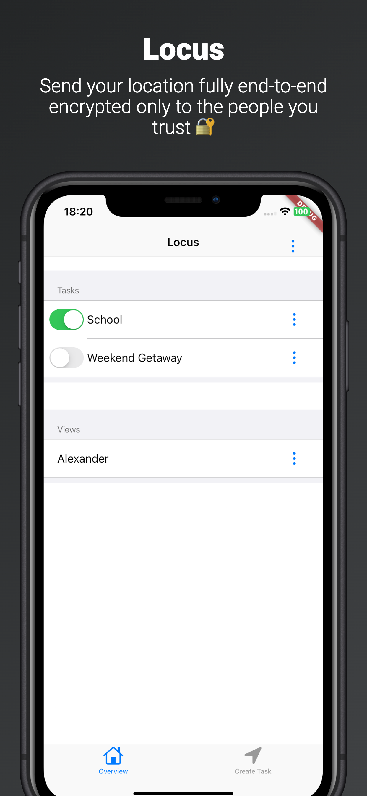
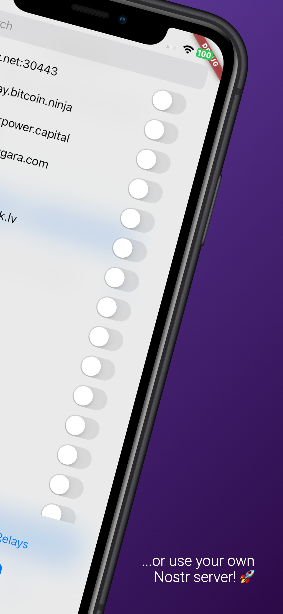
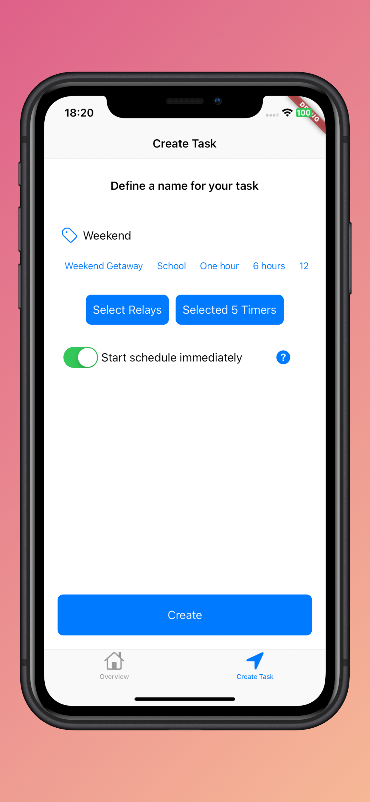
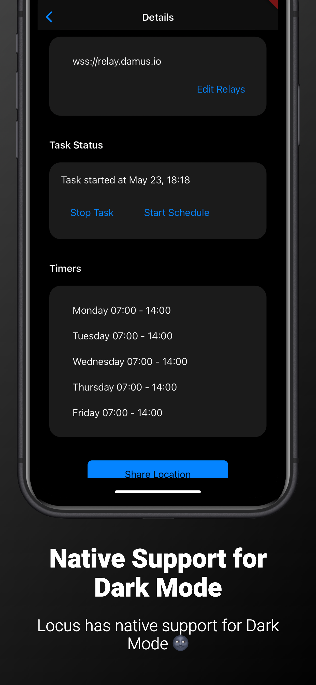
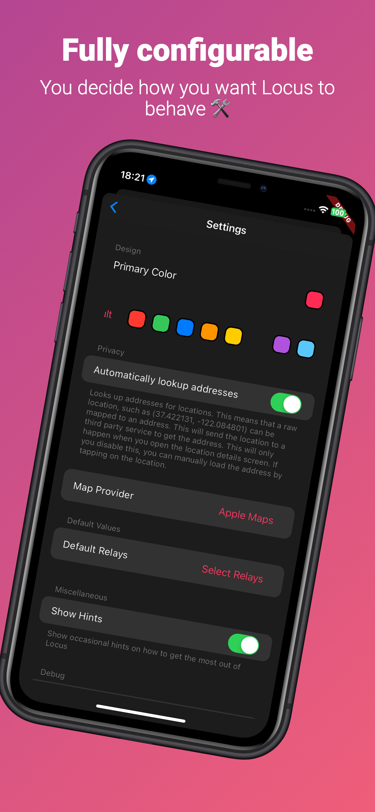
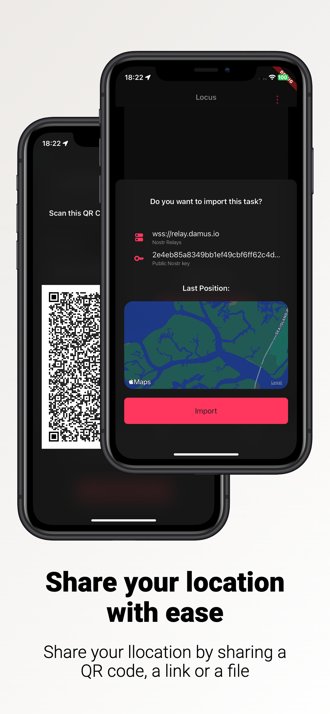

> 
<svg style="fill:currentColor" viewBox="0 0 16 16" version="1.1" width="16" height="16" aria-hidden="true"><path d="M0 1.75C0 .784.784 0 1.75 0h12.5C15.216 0 16 .784 16 1.75v9.5A1.75 1.75 0 0 1 14.25 13H8.06l-2.573 2.573A1.458 1.458 0 0 1 3 14.543V13H1.75A1.75 1.75 0 0 1 0 11.25Zm1.75-.25a.25.25 0 0 0-.25.25v9.5c0 .138.112.25.25.25h2a.75.75 0 0 1 .75.75v2.19l2.72-2.72a.749.749 0 0 1 .53-.22h6.5a.25.25 0 0 0 .25-.25v-9.5a.25.25 0 0 0-.25-.25Zm7 2.25v2.5a.75.75 0 0 1-1.5 0v-2.5a.75.75 0 0 1 1.5 0ZM9 9a1 1 0 1 1-2 0 1 1 0 0 1 2 0Z"></path></svg> Important

> This repository is not verified by or affiliated with Myzel394 or any other Locus developers.

> 
<svg style="fill:currentColor" viewBox="0 0 16 16" version="1.1" width="16" height="16" aria-hidden="true"><path d="M6.457 1.047c.659-1.234 2.427-1.234 3.086 0l6.082 11.378A1.75 1.75 0 0 1 14.082 15H1.918a1.75 1.75 0 0 1-1.543-2.575Zm1.763.707a.25.25 0 0 0-.44 0L1.698 13.132a.25.25 0 0 0 .22.368h12.164a.25.25 0 0 0 .22-.368Zm.53 3.996v2.5a.75.75 0 0 1-1.5 0v-2.5a.75.75 0 0 1 1.5 0ZM9 11a1 1 0 1 1-2 0 1 1 0 0 1 2 0Z"></path></svg> Warning

> Locus is [not considered production ready yet](https://github.com/Myzel394/locus/issues/140#issuecomment-1874019430). Expect bugs.

Locus is a free, open source app that allows you to share your location live. It encrypts your location end-to-end, meaning that no one, not even the Locus developers, can read it. It stores the location decentralized on multiple servers of your choice using Nostr, meaning that you are not locked to a service. No authentication required.

### Screenshots

    
    
    

    
    
    
    

### Download
Please remember that this repository is not verified by or affiliated with Myzel394 or any other Locus developers. None of these downloads are provided by them.

* [Add to AltStore](altstore://source?url=https://jbmagination.com/locus-ios/alt.json)
* [Add to SideStore](sidestore://source?url=https://jbmagination.com/locus-ios/alt.json)
* [Add to Scarlet](scarlet://repo=https://jbmagination.com/locus-ios/scarlet.json)
* [Install via TrollStore](apple-magnifier://install?url=https://github.com/jbmagination/locus-ios/releases/download/releases/latest.ipa)
* [Download IPA](https://github.com/jbmagination/locus-ios/releases/download/releases/latest.ipa)

On Android, the developers officially package Locus and distribute it through [F-Droid](https://f-droid.org/packages/app.myzel394.locus/) and [GitHub](https://github.com/Myzel394/locus/releases/latest).

### Troubleshooting
Please first [make an issue here](https://github.com/jbmagination/locus-ios/issues). If your issue is closed for not being a repository/source problem, then [make an issue here](https://github.com/Myzel394/locus/issues).
